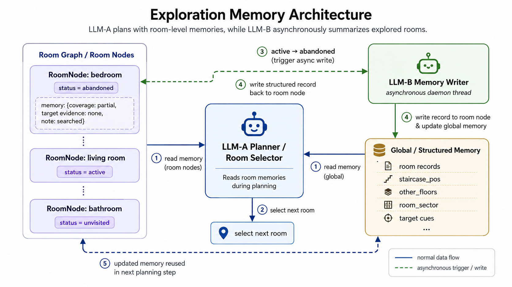

# SG-Nav: Online 3D Scene Graph Prompting for LLM-based Zero-shot Object Navigation
### [Paper](https://arxiv.org/abs/2410.08189) | [Project Page](https://bagh2178.github.io/SG-Nav/) | [Video](https://cloud.tsinghua.edu.cn/f/ae050a060d624be4bc5d/?dl=1) | [中文解读](https://zhuanlan.zhihu.com/p/909651478)

> SG-Nav: Online 3D Scene Graph Prompting for LLM-based Zero-shot Object Navigation  
> [Hang Yin](https://bagh2178.github.io/)*, [Xiuwei Xu](https://xuxw98.github.io/)\* $^\dagger$, [Zhenyu Wu](https://gary3410.github.io/), [Jie Zhou](https://scholar.google.com/citations?user=6a79aPwAAAAJ&hl=en&authuser=1), [Jiwen Lu](http://ivg.au.tsinghua.edu.cn/Jiwen_Lu/)$^\ddagger$  

\* Equal contribution $\dagger$ Project leader $\ddagger$ Corresponding author


We propose a <b>zero-shot</b> object-goal navigation framework by constructing an online 3D scene graph to prompt LLMs. Our method can be directly applied to different kinds of scenes and categories <b>without training</b>.


## News
- [2025/08/01]: [GC-VLN](https://github.com/bagh2178/GC-VLN) is accepted to CoRL 2025! This is a further extension of our scene graph-based navigation series which solves the problem of vision-and-language navigation with graph constraint.
- [2025/02/27]: [UniGoal](https://github.com/bagh2178/UniGoal), an extended version of SG-Nav which unifies different goal-oriented navigation tasks, is accepted to CVPR 2025!
- [2024/12/30]: We update the code and simplify the installation.
- [2024/09/26]: SG-Nav is accepted to NeurIPS 2024!


## Demo
### Scene1:


### Scene2:


Demos are a little bit large; please wait a moment to load them. Welcome to the home page for more complete demos and detailed introductions.


## Method

Method Pipeline:


### Dual-LLM Architecture

This version extends the original SG-Nav with a two-LLM design for more informed navigation:

**LLM A — Room Choice (online)**  
At each navigation step, LLM A receives the current scene graph and the room exploration memory written by LLM B, then predicts which room the agent should explore next. The memory context allows LLM A to avoid revisiting rooms already judged as low-priority and to account for multi-floor layouts.

**LLM B — Exploration Review (asynchronous)**  
LLM B fires asynchronously in a background daemon thread whenever a room transitions from *active* (currently chosen) to *abandoned* (de-prioritised). It writes a structured record for that room covering:

| Field | Values |
|---|---|
| `coverage` | `full` / `partial` / `minimal` |
| `priority` | `high` / `medium` / `low` |
| `confidence` | `high` / `medium` / `low` |
| `note` | one-sentence summary |
| `other_floors_detected` | `yes` / `no` |

Each room's records accumulate in `RoomNode.memory`. LLM A reads the latest record per room when selecting the next exploration target. The `other_floors_detected` flag is also propagated to a shared `global_memory` dict that persists across rooms for the episode.

**Room status state machine**

```
unvisited ──→ active ──→ abandoned
                 ↑____________|
           (re-chosen next step)
```

LLM B is triggered exactly on the `active → abandoned` transition, at most once per `insert_goal()` call.


## Installation

**Step 1 (Dataset)**

Download [Matterport3D scene dataset](https://niessner.github.io/Matterport/) and [object-goal navigation episodes dataset](https://github.com/facebookresearch/habitat-lab/blob/main/DATASETS.md) from [here](https://cloud.tsinghua.edu.cn/f/03e0ca1430a344efa72b/?dl=1).

Set your scene dataset path `SCENES_DIR` and episode dataset path `DATA_PATH` in config file `configs/challenge_objectnav2021.local.rgbd.yaml`.

The structure of the dataset is outlined as follows:
```
MatterPort3D/
├── mp3d/
│   ├── 2azQ1b91cZZ/
│   │   └── 2azQ1b91cZZ.glb
│   ├── 8194nk5LbLH/
│   │   └── 8194nk5LbLH.glb
│   └── ...
└── objectnav/
    └── mp3d/
        └── v1/
            └── val/
                ├── content/
                │   ├── 2azQ1b91cZZ.json.gz
                │   ├── 8194nk5LbLH.json.gz
                │   └── ...
                └── val.json.gz
```

**Step 2 (Environment)**

Create conda environment with python==3.9.
```
conda create -n SG_Nav python==3.9
```

**Step 3 (Simulator)**

Install habitat-sim==0.2.4 and habitat-lab.
```
conda install habitat-sim==0.2.4 -c conda-forge -c aihabitat
pip install -e habitat-lab
```
Then replace the `agent/agent.py` in the installed habitat-sim package with `tools/agent.py` in our repository.
```
HABITAT_SIM_PATH=$(pip show habitat_sim | grep 'Location:' | awk '{print $2}')
cp tools/agent.py ${HABITAT_SIM_PATH}/habitat_sim/agent/
```

**Step 4 (Package)**

Install pytorch<=1.9, pytorch3d and faiss. Install other packages.
```
conda install -c pytorch faiss-gpu=1.8.0
pip install torch==1.9.1+cu111 torchvision==0.10.1+cu111 -f https://download.pytorch.org/whl/torch_stable.html
pip install -r requirements.txt
pip install "git+https://github.com/facebookresearch/pytorch3d.git"
```

Install Grounded SAM.
```
pip install -e segment_anything
pip install --no-build-isolation -e GroundingDINO
wget -O data/models/sam_vit_h_4b8939.pth https://dl.fbaipublicfiles.com/segment_anything/sam_vit_h_4b8939.pth
wget -O data/models/groundingdino_swint_ogc.pth https://github.com/IDEA-Research/GroundingDINO/releases/download/v0.1.0-alpha/groundingdino_swint_ogc.pth
```

Install GLIP model and download GLIP checkpoint.
```
cd GLIP
python setup.py build develop --user
mkdir MODEL
cd MODEL
wget https://huggingface.co/GLIPModel/GLIP/resolve/main/glip_large_model.pth
cd ../../
```

Install Ollama and pull the model used by both LLM A and LLM B.
```
curl -fsSL https://ollama.com/install.sh | sh
ollama pull llama3.2-vision
```

## Evaluation

Run SG-Nav:
```
python SG_Nav.py --visualize
```

The `--visualize` flag saves per-episode MP4 videos to `data/visualization/`. Each frame shows:
- **Observation** — current RGB view with goal category label
- **Occupancy Map** — agent position and trajectory
- **Scene Graph Nodes / Edges** — objects and spatial relations in the 3D scene graph
- **LLM Room Choice** — LLM A's latest room selection reasoning
- **LLM Review** — LLM B's latest exploration record for the room just abandoned

## Citation
```
@article{yin2024sgnav, 
      title={SG-Nav: Online 3D Scene Graph Prompting for LLM-based Zero-shot Object Navigation}, 
      author={Hang Yin and Xiuwei Xu and Zhenyu Wu and Jie Zhou and Jiwen Lu},
      journal={arXiv preprint arXiv:2410.08189},
      year={2024}
}
```
